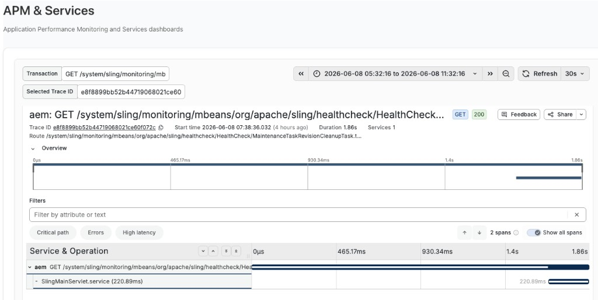
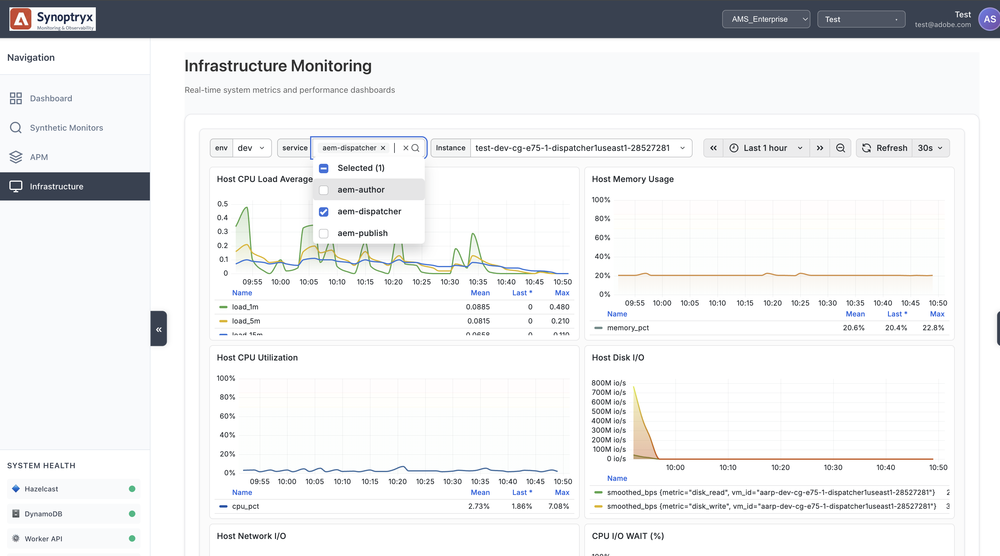
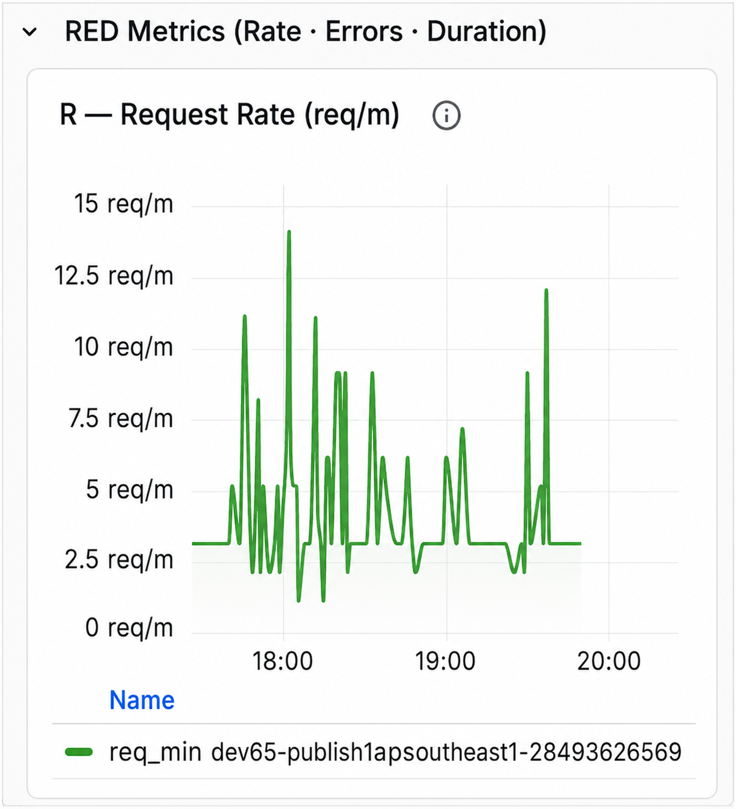

# Supervisión del rendimiento de las aplicaciones (APM) con Synoptryx {#application-performance-monitoring}

Synoptryx Application Performance Monitoring (APM) proporciona insight histórico y en tiempo real sobre el rendimiento de Adobe Experience Manager (AEM) y la experiencia del usuario final. El seguimiento de transacciones, los gráficos y los informes de extremo a extremo proporcionan visibilidad del comportamiento de la aplicación hasta el nivel de código Java.

## Complemento Managed Services Synoptryx APM {#apm-plugin}

AEM se ejecuta como una aplicación Java en Jetty con módulos Apache Felix OSGi, creados en Apache Sling y Jackrabbit Oak. Adobe Managed Services, AEM Engineering y Synoptryx Engineering desarrollaron conjuntamente instrumentación personalizada para entornos de Managed Services.

Esa instrumentación recopila:

- **Nomenclatura de transacción significativa**: las extensiones de Sling alinean los nombres de transacción con la estructura de la página y agregan un atributo `requestURL` en los eventos de Insights para que pueda correlacionar las URL de Sling en los paneles.



- **Instrumentación JCR**: Las operaciones a nivel de repositorio (incluidas XPath y JCR-SQL2) se clasifican y adjuntan a los seguimientos de transacciones en la sección de base de datos de APM.


## Uso de Synoptryx APM {#using-apm}

Utilice APM para buscar problemas de aplicaciones antes de que afecten a los usuarios finales. Autor y Publicación comparten un código base, pero se supervisan como **aplicaciones APM independientes** para que pueda analizar cada nivel de forma independiente.

Todos los entornos de Managed Services incluyen:

- Una aplicación de APM para Author
- Una aplicación de APM para publicación

Seleccione un nombre de aplicación en Synoptryx APM para abrir su panel de información general y monitorización.



## Secciones de panel

El panel de control de Application Performance Management contiene las siguientes secciones:

- Información general
- Métricas de RED (tarifa · Errores · Duración)
- Tráfico
- Latencia y rendimiento
- Detalles del error
- Transacciones Principales
- Estado de JVM
- Memoria JVM
- Recolección de basura

En esta guía solo se documentan las secciones que se muestran a continuación.

## Navegación del panel


El tablero está organizado en secciones ampliables que agrupan las métricas de rendimiento de las aplicaciones relacionadas. Al expandir una sección, se muestran uno o más gráficos asociados con esa categoría.

## Información general


### Descripción

La sección **Información general** presenta indicadores clave de rendimiento (KPI) de alto nivel que resumen el estado actual de la aplicación supervisada.

Estos KPI proporcionan un resumen rápido de la actividad de la aplicación, el rendimiento, el éxito de las solicitudes y la experiencia general del usuario.

### Métrica

#### Total de solicitudes

Muestra el número total de solicitudes procesadas por la aplicación durante el intervalo de tiempo seleccionado.

**Métrica**

```
total_requests
```

**Unidad**

- Recuento

#### Rendimiento actual

Muestra la tasa de procesamiento de la solicitud actual.

**Métrica**

```
throughput
```

**Unidad**

- Solicitudes por segundo (req/s)

#### Tasa de error actual

Muestra el porcentaje de solicitudes que generan errores.

**Métrica**

```
error_rate
```

**Unidad**

- Porcentaje (%)

#### Puntuación de APDEX

Muestra el índice de rendimiento de la aplicación (APDEX), una medida estandarizada de la satisfacción del usuario final basada en los tiempos de respuesta de la aplicación.

El umbral configurado se muestra dentro del widget.

**Métrica**

```
apdex_score
```

**Unidad**

- Puntuación (0,0 - 1,0)

## Métricas de RED

La metodología RED mide tres características principales de una aplicación:

- **Tarifa**
- **Errores**
- **Duración**

### Tasa de solicitudes



#### Descripción

Muestra el número de solicitudes de aplicaciones recibidas a lo largo del tiempo.

Este gráfico representa el rendimiento de las solicitudes mediante una visualización de series temporales.

#### Métrica

```
req_min
```

#### Unidad

- Solicitudes por minuto (req/m)

#### Información mostrada

- Tasa de solicitudes de series de tiempo
- Actividad de solicitud histórica
- Tendencia de tasa de solicitud
- Leyenda de métrica

### Tasa de error


#### Descripción

Muestra el porcentaje de solicitudes que dieron lugar a errores.

El gráfico compara los porcentajes de error históricos y actuales.

#### Métrica

```
error_pct (now)
error_pct (1h ago)
```

#### Unidad

- Porcentaje (%)

#### Información mostrada

- Porcentaje de error actual
- Comparación histórica
- Valores medios
- Tendencia de series temporales

### Duración de solicitud


#### Descripción

Muestra la latencia de la solicitud en varios porcentajes de tiempo de respuesta.

El gráfico representa simultáneamente las mediciones de latencia del percentil recopiladas durante el período de observación seleccionado.

#### Métrica

```
P50
P75
P90
```

#### Unidades

- Milisegundos (ms)
- Segundos (s)

Las unidades se escalan automáticamente según la duración de la respuesta.

#### Estadísticas mostradas

Para cada percentil:

- Media
- Último
- Máximo

#### Definiciones de percentil

| Métrica | Descripción |
| ------ | ----------------------------- |
| P50 | Tiempo de respuesta del percentil 50 |
| P75 | Tiempo de respuesta del percentil 75 |
| P90 | Tiempo de respuesta del percentil 90 |

## Tráfico

### Solicitudes por código de estado HTTP


#### Descripción

Muestra el rendimiento de las solicitudes agrupadas por código de estado de respuesta HTTP.

Cada código de estado se traza de forma independiente a lo largo del tiempo.

#### Métrica

Las métricas comunes incluyen:

```
req_s 200
req_s 300
req_s 400
req_s 500
```

según la actividad de la aplicación.

#### Unidad

- Solicitudes por segundo (req/s)

#### Información mostrada

- Rendimiento por estado HTTP
- Rendimiento medio
- Último rendimiento
- Rendimiento máximo
- Actividad de series de tiempo

### Tasa de solicitudes por punto final


#### Descripción

Muestra los extremos de la aplicación de mayor tráfico clasificados según la tasa de solicitud.

Cada extremo se muestra como una barra horizontal que representa el volumen de la solicitud.

#### Métrica

```
endpoint_request_rate
```

#### Unidad

- Solicitudes por minuto (req/m)

#### Información mostrada

- Ruta de extremo
- Tasa de solicitudes
- Lista de extremos clasificados
- Volumen de solicitud relativo

## Latencia y rendimiento

### Tiempo de respuesta: P95 frente a 1 hora


#### Descripción

Muestra una comparación del tiempo de respuesta P95 actual con el tiempo de respuesta P95 registrado una hora antes.

Ambos conjuntos de datos se muestran en el mismo gráfico de series temporales.

#### Métrica

```
P95 (Current)
P95 (1 Hour Ago)
```

#### Unidades

- Milisegundos (ms)
- Segundos (s)

#### Estadísticas mostradas

- Media
- Último
- Máximo

### Puntuación de APDEX con el tiempo


#### Descripción

Muestra el índice de rendimiento de la aplicación como una serie temporal continua.

El gráfico visualiza los valores de APDEX a lo largo del intervalo de monitorización seleccionado.

#### Métrica

```
APDEX Score
```

#### Unidad

- Puntuación (0,0-1,0)

#### Estadísticas mostradas

- Media
- Último
- Máximo

### Rendimiento frente a latencia P95


#### Descripción

Muestra el rendimiento de la solicitud y la latencia de respuesta P95 en la misma cronología.

El gráfico permite la visualización simultánea del volumen de tráfico y la latencia de respuesta.

#### Métrica

```
Throughput
P95 Latency
```

#### Unidades

| Métrica | Unidad |
| ----------- | ------------ |
| Rendimiento | Solicitudes/s |
| Latencia P95 | Milisegundos |

#### Información mostrada

- Rendimiento de series de tiempo
- Latencia de series de tiempo
- Comparación de métricas dobles

## Detalles del error

### Tasa de error % por grupo de estado


#### Descripción

Muestra los porcentajes de error de la aplicación agrupados por clase de respuesta HTTP.

Se trazan series independientes para cada categoría de respuesta.

#### Métrica

Los grupos comunes incluyen:

```
2xx
3xx
4xx
5xx
Combined Error Trend
```

según el tráfico observado.

#### Unidad

- Porcentaje (%)

#### Información mostrada

- Porcentaje de error por clase de respuesta
- Porcentaje de error medio
- Tendencia de series temporales


### Tendencia de proporción de errores: Ahora frente a hace una hora


#### Descripción

Muestra la proporción de errores de la aplicación actual junto con la proporción de errores registrada una hora antes.

#### Métrica

```
Current Error Ratio
1 Hour Error Ratio
```

#### Unidad

- Porcentaje (%)

#### Información mostrada

- Tendencia actual
- Comparación histórica
- Visualización de series de tiempo

### Tendencia de proporción de errores: Ahora frente a hace 6 horas


#### Descripción

Muestra la proporción de errores de la aplicación actual junto con la proporción de errores registrada seis horas antes.

#### Métrica

```
Current Error Ratio
6 Hour Error Ratio
```

#### Unidad

- Porcentaje (%)

#### Información mostrada

- Proporción de errores actuales
- Comparación histórica
- Visualización de series de tiempo

## Resumen de las métricas del panel

| Panel de control | Métricas principales |
| -------------------------- | --------------------------------------------- |
| Información general | Solicitudes totales, rendimiento, tasa de error, APDEX |
| Tasa de solicitudes | Solicitudes por minuto |
| Tasa de error | Porcentaje de error |
| Duración de solicitud | Latencia de P50, P75, P90 |
| Solicitudes por código de estado | Rendimiento de estado HTTP |
| Tasa de solicitudes por punto final | Volumen de solicitud de extremo |
| Comparación del tiempo de respuesta | P95 actual frente a histórico |
| Puntuación de APDEX | Índice de satisfacción del usuario |
| Rendimiento frente a latencia | Rendimiento de solicitudes y latencia P95 |
| Tasa de error por grupo de estado | Porcentaje de error del grupo de estado HTTP |
| Tendencias de proporción de errores | Proporción de errores actuales e históricos |
