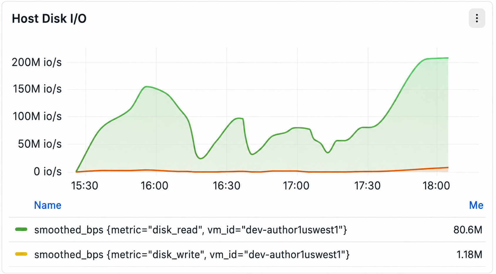

# Panel de supervisión de infraestructura host

En esta sección se describe cada gráfico de monitorización de infraestructura a nivel de host que se muestra en el panel de monitorización de infraestructura. Cada sección explica el propósito de la métrica, los datos que se recopilan, las unidades de medida y la información presentada en la visualización.

## Información general del panel

El panel de monitorización de la infraestructura del host proporciona visibilidad en tiempo real sobre la utilización y el rendimiento del host subyacente. Estas métricas ayudan a los operadores a monitorizar los recursos de computación, memoria, almacenamiento y red, a la vez que identifican posibles cuellos de botella en los recursos.

El tablero incluye los siguientes paneles de monitorización:

- Utilización de CPU del host
- E/S del disco host
- E/S de red host
- Espera de E/S de CPU
- Uso de almacenamiento
- Uso del disco
- Promedio de carga de CPU de host
- Uso de memoria host

## &#x200B;1. Utilización de CPU del host

### Descripción

El panel **Uso de CPU del host** muestra el porcentaje de recursos de CPU que está consumiendo actualmente el sistema operativo y todos los procesos en ejecución a lo largo del tiempo.

Esta métrica representa el uso general de CPU en todo el host y proporciona una visualización de la actividad del procesador en series temporales.

El gráfico permite a los operadores monitorizar cómo cambia el consumo de CPU durante la ventana de observación seleccionada.

### Métrica

| Métrica | Descripción |
| --------- | ---------------------------------------- |
| `cpu_pct` | Porcentaje del total de CPU en uso actualmente |

### Unidades

- Porcentaje (%)

### Estadísticas mostradas

El panel resume el uso de CPU con tres valores:

| Estadística | Descripción |
| --------- | --------------------------------------------------------------- |
| Media | Utilización media de CPU durante el intervalo de tiempo seleccionado |
| Último | Valor de utilización de CPU recopilado más recientemente |
| Max | Mayor utilización de CPU observada durante el intervalo de tiempo seleccionado |

### Componentes de gráfico

- Línea de serie temporal que representa el uso de CPU.
- Eje Y basado en porcentajes que varía de **0% a 100%**.
- Estadísticas de resumen mostradas debajo del gráfico.
- Tendencia histórica en el intervalo de monitorización seleccionado.

## &#x200B;2. E/S del disco host

### Descripción

El panel **E/S del disco host** muestra el rendimiento del almacenamiento para las operaciones de lectura y escritura en disco realizadas por el host.

El gráfico presenta dos series temporales independientes que representan los datos que se transfieren entre el sistema operativo y los dispositivos de almacenamiento.

Esta visualización ayuda a supervisar la actividad de almacenamiento a lo largo del tiempo y proporciona insight al volumen de datos que se leen y se escriben en los discos.

### Métrica

| Métrica | Descripción |
| ------------ | --------------------------------- |
| `disk_read` | Cantidad de datos leídos desde el almacenamiento |
| `disk_write` | Cantidad de datos escritos en el almacenamiento |

Internamente, estas métricas se muestran utilizando valores de rendimiento suavizados.

### Unidades

- Bytes por segundo (B/s)
- Kilobytes por segundo (kB/s)
- Megabytes por segundo (MB/s)
- Gigabytes por segundo (GB/s)

La unidad mostrada se adapta automáticamente en función del rendimiento.

### Componentes de gráfico

- Línea verde que representa el rendimiento de lectura del disco.
- Línea naranja que representa el rendimiento de escritura en disco.
- Visualización de series de tiempo.
- Leyenda separada para cada métrica.
- Valores de métrica actuales mostrados junto a cada serie.

## &#x200B;3. E/S de red host

### Descripción

El panel **E/S de red host** muestra el volumen de tráfico de red transmitido y recibido por el host a lo largo del tiempo.

El gráfico mide la velocidad a la que los datos fluyen a través de las interfaces de red y proporciona visibilidad sobre el consumo de ancho de banda de la red.
Esta métrica representa el rendimiento de red agregado.

### Métrica

| Métrica | Descripción |
| --------------- | --------------------------------------------------------------------- |
| `bytes_per_sec` | Rendimiento de red agregado medido como bytes transferidos por segundo |

### Unidades

El gráfico se adapta automáticamente entre:

- Bytes/s
- KB/s
- MB/s
- GB/s

en función del volumen de tráfico observado.

### Estadísticas mostradas

| Estadística | Descripción |
| --------- | ---------------------------------- |
| Media | Rendimiento medio de la red |
| Último | Medición de rendimiento más reciente |
| Max | Mayor rendimiento observado |

### Componentes de gráfico

- Una sola línea de rendimiento.
- Visualización de series de tiempo.
- Ampliación dinámica del ancho de banda.
- Estadísticas de resumen mostradas debajo del gráfico.

## &#x200B;4. Espera de E/S de CPU

### Descripción

El panel **Espera de E/S de CPU** muestra el porcentaje de tiempo de CPU empleado esperando a que se completen las operaciones de entrada y salida.

Esta métrica representa el tiempo de inactividad del procesador que se produce porque los procesos activos se bloquean mientras se esperan dispositivos de almacenamiento u otras operaciones de E/S.

El gráfico visualiza cómo la espera de E/S cambia con el tiempo.

### Métrica

| Métrica | Descripción |
| --------- | ------------------------------------------------------ |
| `cpu_pct` | Porcentaje de tiempo de CPU empleado esperando en operaciones de E/S |

### Unidades

- Porcentaje (%)

### Estadísticas mostradas

| Estadística | Descripción |
| --------- | ------------------------------- |
| Media | Porcentaje medio de espera de E/S de CPU |
| Último | Valor registrado más recientemente |
| Max | Valor máximo registrado |

### Componentes de gráfico

- Línea de serie temporal.
- Eje Y basado en porcentajes.
- Estadísticas de resumen.
- Visualización de tendencias históricas.

## &#x200B;5. Uso de almacenamiento

### Descripción

El panel **Uso del almacenamiento** muestra el porcentaje general de la capacidad de almacenamiento utilizada actualmente en el host supervisado.

El gráfico proporciona una vista histórica de la utilización de la capacidad del sistema de archivos durante el intervalo de tiempo seleccionado.

### Métrica

| Métrica | Descripción |
| --------------- | -------------------------------------------------- |
| % de uso de almacenamiento | Porcentaje de almacenamiento asignado consumido actualmente |

### Unidades

- Porcentaje (%)

### Componentes de gráfico

- Gráfico de utilización de series temporales.
- Escala porcentual.
- Tendencia de utilización del almacenamiento histórico.

## &#x200B;6. Uso del disco

### Descripción

El panel **Uso del disco** muestra el uso del almacenamiento para cada sistema de archivos o dispositivo de almacenamiento montado.

Cada fila corresponde a un dispositivo de bloque específico o partición montada e informa del porcentaje de espacio actualmente en uso.

Esta tabla proporciona un desglose del uso del almacenamiento a nivel del sistema de archivos.

### Información mostrada

Cada entrada incluye:

| Campo | Descripción |
| --------------- | -------------------------------------------- |
| Dispositivo | Dispositivo de almacenamiento o sistema de archivos montado |
| % usado | Porcentaje de capacidad de almacenamiento utilizada |
| Barra de utilización | Representación visual del consumo de almacenamiento |

### Unidades

- Porcentaje (%)

### Componentes de gráfico

- Lista de sistemas de archivos/dispositivos.
- Porcentaje de utilización.
- Indicador de capacidad codificado por colores.
- Valores de utilización ordenados.

## &#x200B;7. Promedio de carga de CPU de host

### Descripción

El panel **Promedio de carga de host de CPU** muestra los promedios de carga del sistema Linux en tres períodos de tiempo móviles.

A diferencia del uso de CPU, la carga media representa el número promedio de procesos que se están ejecutando de forma activa o que están esperando a que CPU programe o finalice la E/S.

El gráfico muestra simultáneamente tres promedios móviles que proporcionan tendencias de carga de trabajo a corto y largo plazo.

### Métrica

| Métrica | Descripción |
| ---------- | -------------------------------------------- |
| `load_1m` | Carga media del sistema en los últimos 1 minuto |
| `load_5m` | Carga media del sistema en los últimos 5 minutos |
| `load_15m` | Carga media del sistema en los últimos 15 minutos |

### Unidades

- Media de carga (valor sin dimensiones)

### Estadísticas mostradas

Para cada métrica de carga media:

| Estadística | Descripción |
| --------- | --------------------------------------- |
| Media | Carga media durante el intervalo de tiempo seleccionado |
| Último | Último valor de carga registrado |
| Max | Valor máximo de carga observada |

### Componentes de gráfico

- Tres líneas de tendencia independientes.
- Visualización de series de tiempo.
- Leyendas individuales para cada promedio móvil.
- Estadísticas de resumen para cada métrica.

## &#x200B;8. Uso de memoria host

### Descripción

El panel **Uso de memoria host** muestra el porcentaje de memoria física del sistema asignado actualmente por el sistema operativo.

Esta métrica representa la utilización general de RAM en todos los procesos en ejecución, memoria de núcleo, búferes y cachés.

El gráfico proporciona una visión continua del consumo de memoria durante el período de monitorización seleccionado.

### Métrica

| Métrica | Descripción |
| ------------ | ---------------------------------------------- |
| `memory_pct` | Porcentaje de memoria física actualmente en uso |

### Unidades

- Porcentaje (%)

### Estadísticas mostradas

| Estadística | Descripción |
| --------- | ---------------------------------- |
| Media | Utilización media de la memoria |
| Último | Utilización registrada más recientemente |
| Max | Mayor utilización observada |

### Componentes de gráfico

- Gráfico de utilización de memoria de series temporales.
- Eje Y basado en porcentajes.
- Tendencia histórica de utilización.
- Estadísticas de resumen.

## Resumen de las métricas del panel

| Panel de control | Métrica principal | Unidad |
| --------------------- | -------------------------------- | ------------ |
| Utilización de CPU del host | `cpu_pct` | % |
| E/S del disco host | `disk_read`, `disk_write` | Bytes/s |
| E/S de red host | `bytes_per_sec` | Bytes/s |
| Espera de E/S de CPU | `cpu_pct` | % |
| Uso de almacenamiento | % de uso de almacenamiento | % |
| Uso del disco | Uso del sistema de archivos | % |
| Promedio de carga de CPU de host | `load_1m`, `load_5m`, `load_15m` | Media de carga |
| Uso de memoria host | `memory_pct` | % |
